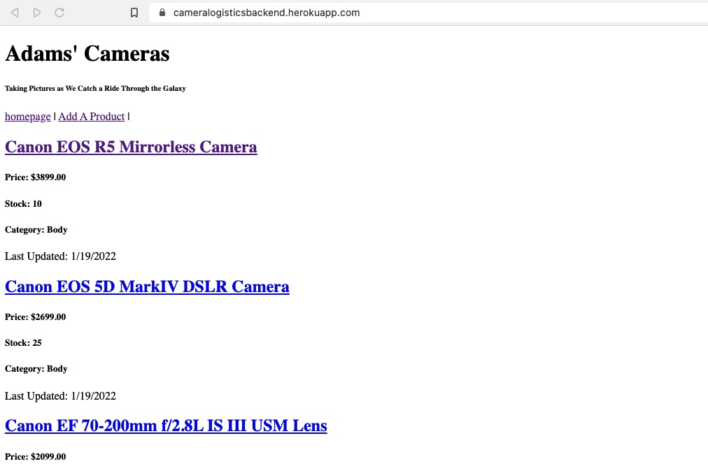
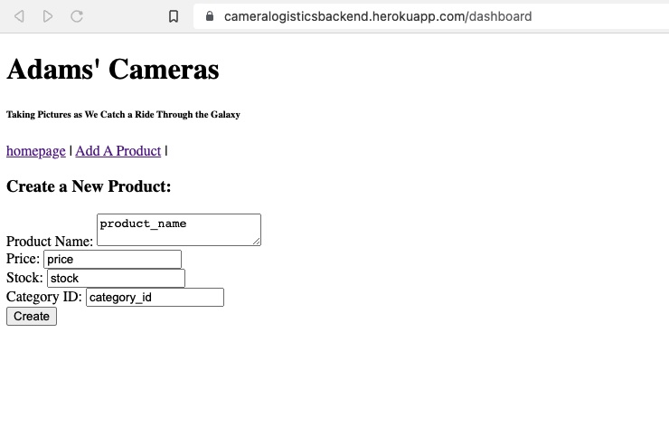
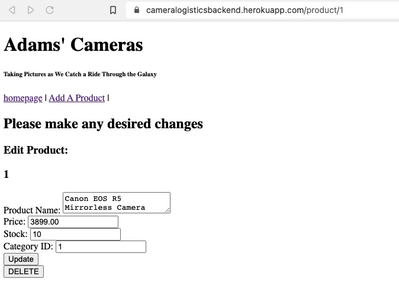
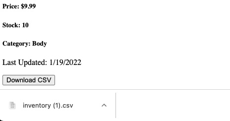

  # Logistics Backend

  ## Table of Contents
  * [Description](#descrip)
  * [Installation](#install)
  * [Usage](#usage)
  * [Contributions](#contri)
  * [Tests](#tests)
  * [Contact & Qustions](#contact)
  * [License](#license)
  * [Powered By](#powered-by)
  
  ### Description:
      Create an inventory tracking system for a company.  Users should be able to Add, View, Update, and Delete inventory items.  The User will also be able to download a CSV with a single click.

  
  ### Installation:
      To make review as easy as possible, it is available for use at the website https://cameralogisticsbackend.herokuapp.com/

  
  ### Usage: 
      Track inventory with a mySQL database
      Navigate to the website and you will be presented with all the inventory in the system.

      Once you are on this page, you can create a nwe item by clicking on the "Add A Product" Naviagtion bar.
      You will be presented with a form that is easy to complete.

      If there are any changes that need to be made to a produce, a user can simply click on the name of the product.  This will take you to a page that allows the item to be edited or deleted.

      If the user needs a file to view, there is the option to download a .csv.  The user will simply click the button at the bottom of the page to generate the report.

  
  ### Contributions:
      

  
  ### Tests
      

  
  ### Contact & Qustions
  If you have any questions, suggestions or concerns, please contact me at:  
  GitHub  
  https://github.com/DerTodd  
  email  
      todd.taylor@utexas.edu  

  
  ### License:
  [MIT](https://opensource.org/licenses/MIT)

  
  #### Powered By
    
    
   

# logistics
TASK: Build an inventory tracking web application for a logistics company. We are looking for a web application that meets the requirements listed below, along with one additional feature, with the options also listed below. 

You can tackle this challenge using any technology you want. This is an open-ended task, but we want to focus on high quality back-end code. Custom UIs and interactive frameworks like React are not necessary.

Please provide instructions on how to use your application. There is no guarantee that a reviewer will be completely familiar with your language, framework, IDE or development environment. Please provide step by step instructions on how to get your application running. Don’t assume any technologies exist in the reviewer's environment. 

Information: You can use frameworks, libraries and external dependencies to help you get faster to the parts you are interested in building, if this helps you; or start from scratch. When building, consider how more features could be added in the future. 

Requirements:
Basic CRUD Functionality. You should be able to:
Create inventory items
Edit Them
Delete Them
View a list of them

ONE OF THE FOLLOWING (We will only evaluate the first feature chosen, so please only choose one)
Push a button export product data to a CSV
Allow image uploads AND store image with generated thumbnails
When deleting, allow deletion comments and undeletion
Filtering based on fields/inventory count/tags/other metadata
Ability to assign/remove inventory items to a named group/collection
Ability to create warehouses/locations and assign inventory to specific locations
Ability to create “shipments” and assign inventory to the shipment, and adjust inventory appropriately
Ability to generate a report on inventory levels over time, like: most in-stock or out-of-stock last month

Authentication and CSS/Design are not required and will not be considered during evaluation.
* Save your work to your GitHub and link the specific challenge to your application. 
